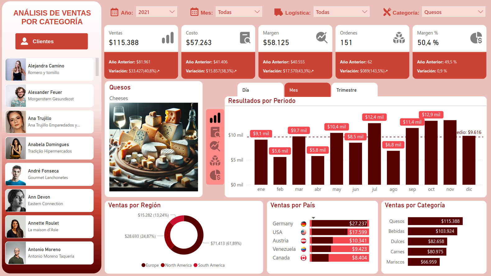

# Dashboard de Ventas por categoría en Power BI

¡Bienvenido a mi proyecto de Dashboard de Ventas por categoría en Power BI! Este proyecto utiliza datos ficticios para crear un dashboard interactivo y visualmente atractivo.



## Contenidos

- [Descripción del Proyecto](#descripción-del-proyecto)
- [Demo](#demo)
- [Instalación](#instalación)
- [Visualizaciones](#visualizaciones)
- [Fuentes de Datos](#fuentes-de-datos)
- [Contribuciones](#contribuciones)
- [Contacto](#contacto)

## Descripción del Proyecto

Este proyecto fue desarrollado como parte de un reto de 21 días organizado por Grow Up Data Analytics a través de YouTube. El objetivo fue crear un dashboard interactivo de análisis de ventas por categoría, utilizando datos ficticios. A lo largo del desafío, personalicé el estilo del dashboard y realicé algunas modificaciones para reflejar mi enfoque y estilo.

## Demo

Puedes interactuar con el dashboard en línea usando el siguiente enlace: [Dashboard de Ventas en Power BI.](https://app.powerbi.com/view?r=eyJrIjoiYWY2N2U1MmUtNTJiMC00OWJkLWFiOTAtMzMxM2VlYjI5M2U3IiwidCI6ImE0ZjQ1Njc3LWMyNDMtNGIyNy1hMmNiLTZmZmY3M2JhN2M3OSIsImMiOjR9)

## Instalación

Para ejecutar este proyecto localmente, sigue los siguientes pasos:

1. Clona este repositorio:
   
   ```bash
   git clone https://github.com/iadataweb/dashboard-ventas.git

## Visualizaciones

El dashboard incluye las siguientes visualizaciones clave:
- Tarjetas KPI con comparaciones respecto al año anterior:
  - Ventas.
  - Costos.
  - Márgenes.
  - Órdenes.
  - Márgenes porcentuales.
- Gráficos Dinámicos:
  - Resultados de métricas (ventas, costos, márgenes, órdenes y márgenes porcentuales) por periodo (mes, día y trimestre).
  - Ventas por Región.
  - Ventas por País.
  - Ventas por Categoría.

## Fuentes de Datos

Los datos utilizados en este proyecto son ficticios y fueron proporcionados por Grow Up Data Analytics como parte del reto para el desarrollo del dashboard.

## Contribuciones

Las contribuciones son bienvenidas. Si deseas contribuir, siéntete libre de abrir un issue o un pull request en este repositorio.

## Contacto

- **LinkedIn:** [Carlos Injante](https://www.linkedin.com/in/20ismael1999/)

¡Gracias por visitar mi proyecto!
